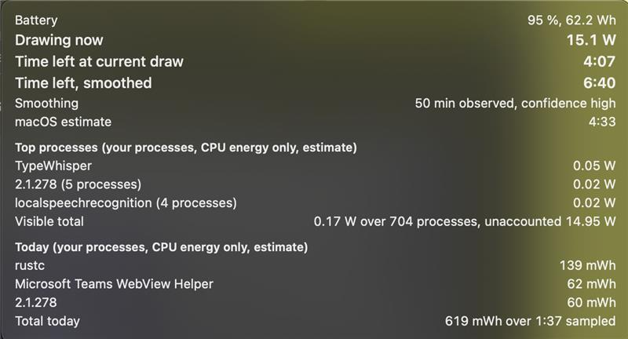
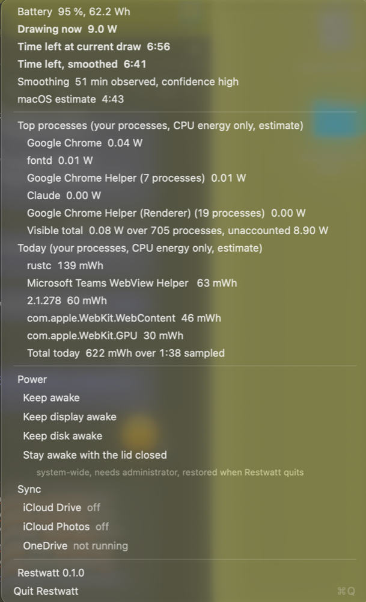

# Restwatt

A small, native macOS menu bar app that shows how much power your Mac is drawing from
its battery right now, how long the battery will last at that rate, and which of your
processes are burning the most energy. While the battery charges it shows the charging
power and its own time to full instead. Both estimates start from the current value and
get steadier the longer the app runs. The menu bar item is drawn as a battery whose fill
follows the charge level, with the figures inside it, so it can stand in for Apple's own
battery item. Its click menu also carries a few settings: keep the Mac, its display or its
disk awake while Restwatt runs, keep the Mac awake with the lid closed, switch Apple's
Energy Mode (Automatic, Low Power, High Power) for the current power source, and start or
stop iCloud Drive, iCloud Photos and OneDrive syncing.

Pure Swift on AppKit, IOKit and libproc. No Electron, no web view, no dependencies, no
network. It writes two small files: its settings and a statistics file that lets the
estimate and a per-process energy total for the day survive a restart (see "How the
estimate works" and "Privacy").

<p align="center">
  
</p>

<p align="center">
  
</p>

Both screenshots are from 0.1.0, before the battery-shaped item and the `Energy Mode`
group were added.

## What it shows

**Menu bar title** while the battery is draining: the current draw in watts and the
smoothed time to empty as `h:mm`, for example `7.9 W  8:12`. Until the first gauge
reading arrives it shows `--:--`. The state is decided by the direction of the energy
flow through the battery, not by whether something is plugged in:

- Energy leaves the battery and no external source is connected: `7.9 W  8:12`.
- Energy leaves the battery although an external source is connected (a power bank or a
  small adapter that delivers less than the Mac uses): the same figures plus the marker
  `weak source`, for example `2.3 W  27:47  weak source`. The watts are what the battery
  still supplies on top of the source, not the whole system draw.
- Energy enters the battery: `Charging` plus Restwatt's own smoothed time to full, for
  example `Charging  0:22`; just `Charging` until the first estimate exists.
- An external source is connected and the net flow is inside a small dead band around
  zero: `On AC`, or `On AC  100 %` once the gauge reports the battery as fully charged.
- The source was just plugged in or unplugged and the gauge has not caught up yet: only
  the charge level, for example `95 %` (see "Which state is shown" below).

Without a battery it reads `No battery`.

**Battery shape.** While a battery is readable, the item is not plain text but a drawn
image in the shape of a battery: a rounded outline with a small nub on the right, a fill
that starts at the left edge and grows with the charge level (a charge level outside 0 to
100 is clamped), and the text above inside the outline, unchanged. No percentage figure is
added; the fill is the level. Outline and text take the label colour of the menu bar's
current appearance, light or dark; the fill is translucent so the text over it stays
readable, and its colour follows the convention of Apple's own item: red at 20 % or less
while the battery drains (on battery or with a weak source), green while charging or when
the battery is fully charged on external power, yellow while Low Power Mode is in effect
(the state macOS reports to the process, not the row marked in the menu), and the label
colour otherwise (draining above that level, on AC and not charging, a plug event waiting
for the gauge). The image is drawn again on every sample, whenever the item's appearance
changes and whenever Low Power Mode goes on or off; it is not a template image, so macOS
does not recolour it. The button keeps the text as its accessibility label, so VoiceOver
reads `7.9 W  8:12` as before. Without a battery the item stays plain text. The geometry
(fill width from the percent, outline, nub, text position) and the colour rule are pure
logic in `RestwattCore` (`BatteryGlyph`) with unit tests; only the AppKit drawing is app
code, so the look itself (contrast, vertical position in the menu bar, whether the redraw
on an appearance change fires promptly) has no automated test and is judged by eye; the
next sample redraws the item in any case.

With the level shown in Restwatt's item you can hide Apple's battery item: System
Settings > Control Center > Battery, turn off `Show in Menu Bar`. Apple's battery menu
also carries the Energy Mode switch; Restwatt's click menu has the same switch (see
"What it can do"), so nothing is lost by hiding it. Restwatt does not change that setting
itself.

**Mouseover** on the item opens a popover with the details, without a click. It appears
after a short delay while the pointer rests on the item and closes shortly after the
pointer leaves both the item and the popover (the delays are the `showDelay` and
`hideDelay` constants in `Sources/RestwattApp/StatusItemController.swift`). The popover
is a two-column label/value grid in the normal label colour, so it follows a light or
dark menu bar; the numbers use monospaced digits, and the three figures to read at a
glance, the current draw and both time-left values, are set larger and bolder:

```
Battery                          95 %, 63.0 Wh
Drawing now                              7.1 W
Time left at current draw                 8:49
Time left, smoothed                       8:12
Smoothing        42 min observed, confidence high
macOS estimate                            7:46

Top processes (your processes, CPU energy only, estimate)
Discord Helper (Renderer) (2 processes)  0.42 W
com.apple.WebKit.WebContent              0.02 W
Restwatt                                 0.01 W
Visible total    0.63 W over 105 processes, unaccounted 6.51 W

Today (your processes, CPU energy only, estimate)
Discord Helper (Renderer)              1.02 Wh
node                                   310 mWh
Restwatt                                12 mWh
Total today          1.74 Wh over 4:12 sampled
```

The `Today` block under the live list is the same per-process picture summed over the
current calendar day: the CPU energy attributed to each process name since local midnight,
in watt-hours (whole milliwatt-hours below one watt-hour, `x.xx Wh` from there), the
three largest names in the popover, and a `Total today` line with the energy of every
counted name and how long was sampled that day as `h:mm`. It survives a restart of the
app (see "How the estimate works"), so on a launch later in the day it is there from the
first tick, next to a live list that is still collecting its first interval. The block is
absent until the first interval of the day has been sampled.

With a weak source the same rows appear, `Drawing now` being what the battery still
supplies, followed by a `Power source` row that says `connected, but it delivers less
than the Mac uses`. While charging the rows are `Charging at`, `Time to full at current
power`, `Time to full, smoothed` with the same `Smoothing` note, and `macOS estimate`
for the gauge's own time to full (or `not yet available` when the gauge does not know
one):

```
Battery                          75 %, 51.7 Wh
Charging at                             49.1 W
Time to full at current power             0:22
Time to full, smoothed                    0:22
Smoothing         0 min observed, confidence low
macOS estimate                            0:50
Source rating                             96 W
```

`Source rating` is the rated power of the connected source as the gauge reports it
(`AdapterDetails.Watts`); the row appears in every state with a source connected, except
while the source is changing, and is omitted when the gauge does not report a rating. On
AC power inside the dead band a single `Power` row says `On AC, fully charged` or
`On AC, not charging`; while the source is changing it says `power source changed,
waiting for the gauge`. Before the first estimate the time row reads `waiting for the
first gauge reading`.

The popover does not take focus away from the app you are working in and is rebuilt from
the latest sample whenever it is shown or a new sample arrives while it is visible. It
closes when the click menu opens. The menu bar item is hosted by the system, not by a
window the app owns, so Restwatt cannot be told directly when the pointer enters it.
Instead it watches pointer movement system-wide and checks each position against the
item's current frame; only the resulting enter and leave transitions drive the popover.
The rows and the enter/leave logic (`PointerRegionTracker`) come from the unit-tested
`RestwattCore` layer; showing and hiding the popover itself is AppKit code without an
automated test, so please open an issue if the popover does not appear or does not go
away for you.

**Click** on the item opens a menu with the same rows, the top five processes, the five
largest `Today` names with the total, the settings section described under "What it can
do", the version number and
`Quit Restwatt`. The information lines are display-only: they are drawn in the normal
label colour but do not highlight under the pointer, a click on them does nothing and
leaves the menu open, and keyboard navigation skips them; only the checkmark items and
`Quit Restwatt` respond. The menu is rebuilt from the latest sample each time it opens,
and Cmd-Q inside the menu quits.

## What it can do

The click menu ends with a settings section: three headings with checkmark items under
them. It replaces two shell scripts that used to switch the same things by hand, and the
Energy Mode group of Apple's battery menu. Every
checkmark shows the state Restwatt reads from the system when the menu opens and again
after each click (the assertion it holds, `pmset -g`, `pmset -g cap`, `pmset -g custom`,
`launchctl print`, the running
applications), never a stored intention: a click that did not take effect leaves the
checkmark where it was and puts the reason in an indented line under the item.

```
Power
    [x] Keep awake
    [ ] Keep display awake
    [ ] Keep disk awake
    [x] Stay awake with the lid closed
        system-wide, needs administrator, restored when Restwatt quits
Energy Mode
        Power Source: Battery
    [ ] Automatic  powermode 0
    [x] Low Power  powermode 1
    [ ] High Power  powermode 2
Sync
    [x] iCloud Drive  running
    [x] iCloud Photos  idle, starts on demand
    [ ] OneDrive  not running
```

**Keep awake**, **Keep display awake** and **Keep disk awake** are process-scoped. Each
holds one IOKit power assertion in Restwatt's own process (`PreventUserIdleSystemSleep`,
`PreventUserIdleDisplaySleep`, `PreventDiskIdle`, the mechanism `caffeinate` uses),
needs no privileges, and appears in `pmset -g assertions` as `Restwatt: Keep awake` and
so on while it is held. Turning a toggle off releases the assertion; quitting or killing
Restwatt releases every assertion with the process, so these three cannot outlive the
app. The choice is remembered in the settings file and re-acquired at the next launch.
If the system refuses one of them at launch, that toggle shows off with the reason under
it, the other remembered toggles are acquired all the same, and the choice stays in the
file: the checkmark follows what Restwatt holds, the file keeps what you chose, and the
next launch tries again without a click. Turning the toggle off is what changes the file;
a refused click from off changes nothing, so no file appears for it.
`Keep awake` prevents idle sleep only: closing the lid still puts the Mac to sleep. If
you run a LaunchAgent of your own that keeps `caffeinate -d` alive, `Keep display awake`
is redundant with it; Restwatt leaves such an agent alone and neither loads nor unloads
it.

**Stay awake with the lid closed** is different: it is a system setting, it needs
administrator rights, and it survives the app. Turning it on runs

```
pmset -a sleep 0 displaysleep 0 disksleep 0 hibernatemode 0 standby 0 disablesleep 1
```

and turning it off runs, in this order,

```
pmset -a disablesleep 0
pmset -b displaysleep 2 sleep 10 disksleep 10 hibernatemode 3 standby 1
pmset -c displaysleep 10 sleep 30 disksleep 10 hibernatemode 3 standby 1
pmset -a standbydelaylow 10800 standbydelayhigh 86400
```

The "off" values are one chosen saver profile (the one the replaced script wrote), not a
captured factory default and not whatever your Mac had before: Restwatt does not save or
restore earlier `pmset` values. Both command lines are constants in `RestwattCore` and
the unit tests pin them word for word, so the text above cannot drift from the code. To
run `pmset` as root, Restwatt tries `sudo -n pmset ...` for each call of the profile in
turn, which succeeds only when sudo needs no password for your account and fails at once
otherwise. Restwatt tells the two ways a call can fail apart: sudo refusing to run
without a password (`sudo -n` exits with status 1 and reports `a password is required` or
`a terminal is required` on its own stderr) is a denial; any other failure is `pmset`
itself, which ran as root and refused its arguments, for example a key this hardware does
not support. A denial, and any other failure sudo reports on its own account (exit
status 1 with a line prefixed `sudo:` on stderr), opens the native macOS administrator
dialog (`osascript`, `do shell script ... with administrator privileges`), once per
profile and only for the calls sudo did not get to run, chained into that single dialog;
the calls that already succeeded are not run again, and when the dialog is declined the
toggle names the `sudo -n` command line that actually ran together with the dialog's
answer. A `pmset` failure (its own `pmset:` message, an empty stderr or any other exit
status) stops the profile at that call, opens no dialog, re-runs nothing, and puts the
failing command line, its exit status and its own message under the toggle; the calls
before it stay applied. Nothing but `pmset` with these
fixed arguments and the six fixed Energy Mode lines below ever runs with administrator
rights, no command line is built from user
data, and Restwatt never creates, edits or recommends a rule that lets sudo skip the
password. Cancelling the dialog, or any other failure, leaves the checkmark off, as
observed, with the reason under the item. The denial texts are sudo's documented wording;
the unit tests pin them, a live denial was not recorded during development.

Two safety facts, stated plainly:

1. **The lid-closed setting outlives the app, so Restwatt takes it back.** The menu says
   so under the toggle. The record comes first: when you turn the toggle on, Restwatt
   writes "armed by Restwatt" into its settings file before `pmset` runs as root, and if
   that file cannot be saved the awake profile is not written at all and the toggle says
   so (`not written, the settings file could not be saved`). So there is never a
   `disablesleep 1` of Restwatt's without a record of it, whatever happens in between.
   When Restwatt quits normally (`Quit Restwatt` or Cmd-Q) while it had turned the setting
   on, it writes the saver profile first (on a Mac where sudo asks for a password that is
   one administrator dialog at quit; cancelling it leaves the setting on, and Restwatt
   keeps the record, so it still owes the reset). A crash, a `kill` or a Force Quit skips
   that quit step: the Mac stays unable to sleep until Restwatt runs again, and the reset
   happens at that next launch. At every launch Restwatt reads its record and `pmset -g`
   and handles the four combinations: record on and `SleepDisabled 1` is Restwatt's own
   setting, so it writes the saver profile then; record on and `SleepDisabled 0` means
   the write never landed (the record was saved, then the dialog was cancelled or the
   app died before `pmset` ran) or somebody else already reset it, so the record is
   dropped quietly with no write; no record and `SleepDisabled 1` is somebody else's
   setting and is left alone; no record and `SleepDisabled 0` is nothing to do. The same
   quiet drop happens after a click whose write did not land, so a cancelled dialog does
   not leave a stale record behind: the record a click wrote ahead follows the outcome of
   that write, and when no call of the awake profile ran as root it is dropped at once,
   even when `pmset -g` cannot be read right after, so Restwatt owes no reset and writes
   nothing at quit. Only when at least one call landed does the record stay, and quit or
   the next launch takes the setting back. That launch write does not depend on anything
   else Restwatt does at launch; a power assertion the system refuses to re-acquire does
   not skip it. When a record from an earlier run is on but `pmset -g` cannot be read, the
   record stays and the quit reconcile tries again.
   Restwatt only ever takes back what it set itself. A `SleepDisabled 1` that another
   tool or script set is left alone and shown as on with the note `set outside
   Restwatt`; turning that toggle off by hand writes the saver profile all the same. The
   record, not the last writer, decides: if you turn the toggle on in Restwatt and then
   run your own `pmset` script on top, Restwatt still writes the saver profile at quit.
   So the toggle effectively means "while Restwatt runs"; for a Mac that stays awake
   without Restwatt, use `pmset` yourself.
2. **Sync off stays off until something turns it on.** The same holds for the Energy
   Mode, see below. `iCloud Drive` (`com.apple.bird`)
   and `iCloud Photos` (`com.apple.cloudphotod`) are switched with `launchctl bootstrap`
   plus `kickstart` and with `launchctl bootout` in your login session domain
   (`gui/<uid>`); `OneDrive` is started hidden and without activating it through
   LaunchServices (what `open -gja OneDrive` does) and stopped by the quit request the
   running application receives. These are immediate actions on the running system.
   Restwatt does not store the sync choice and does not touch sync at launch or quit, so
   once Restwatt is gone the services stay in whatever state they were left in. The
   menu shows that state to the right of each item (`running`, `idle, starts on demand`,
   `off`, `not running`), read from `launchctl print` and the list of running
   applications. To get sync back, click the item again or run `launchctl bootstrap`
   yourself; launchd is also expected to load the two system agents again at the next
   login, but that comes from the `launchctl` manual and was not measured. `bootout`
   does not disable a service, so a reboot or re-login does not keep sync off either.

**Energy Mode** is the switch from Apple's battery menu (Automatic, Low Power, High
Power), for the power source the Mac is on right now. The group names that source the way
Apple's menu does (`Power Source: Battery` or `Power Source: AC`) and marks the row whose
value `pmset -g custom` reports for it; the source itself comes from the header of
`pmset -g cap`. Both are read when the menu opens and again after each click; nothing is
stored in the settings file, nothing is armed, and nothing is reset when Restwatt quits,
because the mode is a setting Apple exposes to the user and is meant to outlive any app.
The mode of the other source is neither shown nor changed, as in Apple's menu. `High
Power` is offered only when `pmset -g cap` lists `highpowermode` for the current source
or the value read is already 2, so a Mac without it does not get a row that `pmset`
would refuse; on the development Mac (an Apple silicon MacBook Pro with High Power) it
is listed, whether it is absent on a Mac without High Power was not measured. When the
current source has no `powermode` line the row `Automatic` is marked and a note under the
group says `pmset lists no powermode for Battery Power, read as Automatic`; a value
outside 0, 1 and 2 marks nothing and a note says `powermode 7 is not a known energy
mode`. When the source cannot be read (`pmset -g cap` failed or names a source Restwatt
does not address, such as UPS power) the group says `Power Source: unknown`, marks
nothing, names the reason, and a click is refused without running anything as root
(`not written while the power source could not be read`).

Clicking an unmarked row runs exactly one of these six fixed commands as administrator,
through the same path as `Stay awake with the lid closed` (`sudo -n` first, the
administrator dialog only when sudo refuses to run without a password, a `pmset` failure
shown under the row without a dialog; see above for how the two are told apart):

```
pmset -b lowpowermode 0
pmset -b lowpowermode 1
pmset -b lowpowermode 2
pmset -c lowpowermode 0
pmset -c lowpowermode 1
pmset -c lowpowermode 2
```

`-b` is used on battery and `-c` on AC; never `-a`, so only the current source changes.
Clicking the marked row runs nothing. Success is the value read back, not the exit
status: after the write Restwatt reads `pmset -g custom` again, and when the current
source still shows another value the row says so, for example `could not change: pmset
accepted lowpowermode 2 but reports powermode 1 for Battery Power`, and the checkmark
stays on the observed value. A `pmset` refusal reads `could not change: /usr/bin/pmset -b
lowpowermode 2 exit 1:` followed by pmset's own message; a re-read that fails after the
write is reported as such (`written, but the energy mode could not be re-read`). The six
command lines are constants in `RestwattCore` and the unit tests pin them word for word.

About the values: `pmset` reports the mode as `powermode`, while the key it accepts for
writing is `lowpowermode` (the key `pmset -g cap` lists and outside documentation uses);
the app writes `lowpowermode` and reads `powermode`. On the development Mac the value
1 = Low Power was confirmed against Apple's own menu (`pmset -g custom` showed
`powermode 1` for `Battery Power` while Apple's menu had Low Power selected on battery);
0 = Automatic and 2 = High Power are what that Mac reports and what outside documentation
says, but were not confirmed against Apple's menu there, and no write with
`lowpowermode` was run on that Mac during development. Until that is confirmed each row
shows the raw value it reads or writes (`powermode 0`, `powermode 1`, `powermode 2`)
next to its label, so a wrong assumption would be visible rather than silent: a write
that does not land shows up under the row, and a mapping other than assumed shows up as
a checkmark on a row whose raw value you can compare with `pmset -g custom` yourself.

A few practical notes. Starting OneDrive and asking it to quit both return before the
application has finished, so right after the click the checkmark can still show the old
state; it is read again when the menu opens next. Whether a `launchctl` call succeeded is
judged by the state read back afterwards, not by its exit code (the exit codes appear in
the reason line only when the target state was not reached). If the settings file cannot
be written, the action still happens and a line at the bottom of the section says
`settings could not be saved` with the reason; the one exception is turning `Stay awake
with the lid closed` on, which needs its record saved first and is refused otherwise
(see safety fact 1). If `pmset -g` cannot be read, the lid-closed toggle shows off with
`could not read pmset` and the reason, and nothing is written at launch. Clicking it in
that state refuses to write the awake profile (`not written, could not read pmset` plus
the reason), because a setting written blind could never be switched off from the menu
again; only when Restwatt's own record says it turned the setting on does the click write
the saver profile, the safe direction. If OneDrive cannot be started under any of its
bundle identifiers, the reason shown is the one for the primary identifier
(`com.microsoft.OneDrive-mac`), not the last fallback's. The privileged path, the
`launchctl` switching and the OneDrive control were tested against doubles that pin the
exact commands and simulate the resulting system state; they were not exercised against a
live system during development, and clicking the items is not automated. Please open an
issue if a toggle misbehaves on your Mac.

## How the estimate works

Restwatt reads the battery gauge (`AppleSmartBattery` in the IOKit registry) every
30 seconds (`Sampling.interval` in `Sources/RestwattCore/BatteryMonitor.swift`), plus one
extra reading 5 seconds after the launch tick (`Sampling.secondSampleDelay`, see
"Footprint"). From each reading it derives:

- **Draw in watts**: the gauge's own `BatteryPower` figure. If that figure disagrees
  with voltage times amperage by more than 10 %, voltage times amperage wins.
- **Remaining energy in Wh**: remaining charge (mAh) times the present voltage. It is
  deliberately not derived from the percentage, because the gauge's full-charge
  capacity drifts between readings.
- **Missing energy in Wh**: full-charge capacity minus remaining charge, times the
  present voltage, never below zero (the full-charge capacity can briefly sit below the
  remaining charge while it drifts).
- **Time left at current draw**: remaining Wh divided by the current draw. This is the
  "if it keeps drawing like right now" figure.
- **Time to full at current power**: missing Wh divided by the current charging power,
  the same figure in the other direction.

The **smoothed** time uses an adaptive exponentially weighted moving average of the
power flowing through the battery. One estimator serves both directions: while the
battery drains it is fed with the draw and the remaining energy, while it charges with
the charging power and the missing energy.

1. The first sample is taken as is, so the first estimate equals the one at current power.
2. Every later sample moves the smoothed power by a fraction that depends on a time
   constant. The time constant is half the observation window so far, clamped between
   60 seconds and 1800 seconds (30 minutes). Early on, the estimate follows the power
   closely; after half an hour a single noisy gauge reading barely moves it, while a
   lasting change in your workload still shows up within a few multiples of 30 minutes.
3. A **confidence** level is shown next to it: `low` below 5 minutes of observation,
   `medium` below 30 minutes, `high` from 30 minutes on.

Duplicate gauge readings (same `UpdateTime`) are not fed into the estimator, so polling
more often than the gauge refreshes does not distort the average. The smoothing restarts
whenever the shown state changes: when the direction of the flow flips between draining
and charging, when a weak source is plugged into a Mac running on battery (the draw
changes meaning from "whole system" to "what the source does not cover"), and around a
plug or unplug event.

### What Restwatt remembers

The estimate survives a restart of the app. For each of the three flow states that have
an estimator (draining on battery, draining with a weak source, charging) Restwatt keeps
the smoothed power, the observation window behind it (and with it the confidence and the
time constant) and the sample count in its statistics file, together with the wall-clock
time of the last tick that showed that state. The file is written at most once per tick
and when the app quits (see "Footprint"). The first time a flow state is shown in a
session, at launch or later (launch on AC, unplug ten minutes in), the estimator picks up
where that state left off; later switches within the session start fresh, as described
above. A fresh start does not erase the file, though: the remembered entry of a state is
kept as long as resuming it right now would give a longer observation window than the
fresh estimator carries, and the fresh estimator is written once its window is the
longer. Plugging in for a minute and unplugging again therefore restarts the smoothing
on screen, while the hour of observation stays in the file (and keeps ageing by the gap
rule below) until the new run has observed more; in the test suite the remembered hour
survives a two-minute flip and hands over after 30 minutes of fresh observation. Whether
the remembered state is trusted is decided by one rule, each branch of which has a unit
test:

- **Direction.** Only the entry of the state now shown is used. A remembered charging
  estimate is never applied to draining; it stays in the file for the next charge.
- **Reboot.** The file carries the boot time of the Mac (`kern.boottime`). If the current
  boot time differs from it by more than a minute, every remembered estimate is
  discarded when the file is loaded, whichever state is shown: the workload after a
  reboot is a new one, and the first write of the new session no longer carries the
  entries of the old boot (a unit test loads two remembered states across a simulated
  reboot and finds neither of the old entries in the rewritten file; the resumed state
  reappears only as a fresh entry of the new session). When the boot time is unknown on
  either side, the gap alone decides.
- **Gap.** The pause between the last remembered tick and now (wall clock) is subtracted
  from the remembered observation window, second for second, starting from at most one
  hour of observation (beyond an hour the time constant has stopped growing, so more is
  not worth remembering). A window that ends at zero or below is discarded; a clock that
  ran backwards discards it too. What remains is the smoothed power with the shortened
  window, so a lower confidence and a smaller time constant. In the test suite: an hour
  observed and a 45-minute pause leaves 15 minutes of observation and `medium`
  confidence; a restart after 3 seconds keeps practically everything; a pause of an hour
  or more (quit, sleep, reboot) forgets the estimate even after a whole day of
  observation.
- **Resume.** The first gauge sample after a resume only sets the current values and the
  session's time anchor; it does not move the smoothed power, because no in-session
  interval exists yet. From the second sample on the smoothing continues with the time
  constant the shortened window implies. Until that first sample the time row reads
  `waiting for the first gauge reading`, as on a cold start. The `Smoothing` row counts
  the remembered observation in its minutes; nothing marks it as remembered.
- **Plausibility.** Only figures that could be measurements are read back. An entry is
  dropped when a figure is not a number, negative or beyond a generous physical ceiling
  (1000 W smoothed power, a year of observation and one sample per second over that
  year for an estimator entry; 24000 Wh per figure and a week of sampled seconds for the
  day's statistic), and so is an entry under a flow state Restwatt does not know. The
  day is dropped as a whole when its key is not of the `YYYY-MM-DD` shape or its own
  totals are absurd; a single absurd name is dropped alone. The ceilings and the drop
  rules are held by unit tests, and a test drives absurd values (negative, far beyond
  the ceilings, not a number, infinite) through every popover, menu and tooltip line to
  make sure nothing traps: what is not a measurement is shown as zero.

Inside a session Restwatt keeps running on the system uptime clock, which stands still
during sleep and restarts at boot; only the file carries wall-clock times. Sleep within
a session is not detected. A missing or unreadable file, or an entry with nonsensical
values, means a cold start without any error message.

Below a power of 0.1 W no time is shown in either direction. Times above 5999 minutes
are shown as `> 99 h`.

### Which state is shown

With no external source connected the battery is draining, whatever the sign of the
gauge's current. With a source connected the net flow decides: a battery draw of 0.5 W
or more means `weak source` draining, a charging power of 0.5 W or more means charging,
anything in between is `On AC` and claims no power and no time. The dead band exists so
that a trickle around zero cannot flip the display back and forth; there is no further
hysteresis. The gauge's `IsCharging` flag does not override the sign, because a source
that delivers less than the Mac uses can leave the battery draining while the flags say
otherwise.

Plugging in or unplugging triggers an immediate re-sample, but the gauge's current and
power figures only change together with its `UpdateTime`, which can be up to a gauge
refresh later. A reading whose `ExternalConnected` flag flipped while its `UpdateTime`
stayed the same provably predates the change, so Restwatt shows only the charge level
(`95 %`, row `power source changed, waiting for the gauge`) until the gauge moves on,
instead of a stale direction (a fresh charger shown as `weak source`, or a negative draw
right after unplugging). A flip that arrives together with a new `UpdateTime` is trusted
as is.

### What it cannot know

- The gauge decides when it updates. On the Mac Restwatt was developed on, all gauge
  values changed together about once a minute, so the "current draw" is always the
  gauge's latest average, never an instantaneous reading.
- Restwatt cannot see the future. Both figures assume the draw stays as it is (current)
  or as it has been on average (smoothed). Opening a video call will invalidate either.
- macOS keeps its own time-to-empty estimators, and they disagree with each other. The
  details show the one `pmset -g batt` shows, labelled `macOS estimate`, for comparison.
  While charging the same row shows the gauge's own `AvgTimeToFull`, when it knows one.
- **The time to full is linear.** Restwatt divides the missing energy by the smoothed
  charging power and knows nothing about the charge curve: near a full charge the
  charger reduces the current and the last part takes longer than the arithmetic
  suggests. So while the power is still high, Restwatt's figure is shorter than macOS's
  (in the measured 96 W reading in the test suite, 0:22 next to the gauge's 0:50); it
  catches up as the power falls, because the smoothing follows it. Both figures are
  shown so you can compare.
- **Weak sources were not measured.** The charging path was verified against a gauge
  reading taken on a 96 W USB-C charger. The `weak source`, slow-charge and near-zero
  states are covered by synthetic unit-test fixtures only; nobody had a power bank or a
  small adapter at hand. The design relies on the sign of the gauge's current and on
  `ExternalConnected` being set while a source is connected, not on the flags, but that
  the gauge behaves that way on a weak source is an expectation, not a measurement.
  `AdapterDetails.Watts` may be absent on a source that does not negotiate USB-C PD; the
  `Source rating` row is then simply omitted.
- The **process list is a partial picture and an estimate**. It ranks the processes your
  user account may inspect by the kernel's per-process CPU energy counter
  (`ri_energy_nj` from `proc_pid_rusage`), aggregated by process name, as average watts
  over the last interval. Root and system processes, the display, the GPU and the rest
  of the SoC are invisible to an unprivileged app. The `Visible total` and the
  `unaccounted` remainder make that gap explicit; on the Mac Restwatt was developed
  on, the visible processes accounted for well under a watt of the several watts the
  battery delivered. If no process reported measurable energy over the last interval,
  the list says so instead of listing anything. The `Today` block sums the same partial
  picture over the day: every visible name's watts times the interval length, added to
  that name's total for the current local calendar day (the interval that spans
  midnight counts to the new day, and a new day starts from zero). The file keeps the
  20 largest names; whatever falls below is folded into the `Total today` line, so the
  total stays right while a small process that later grows starts again from zero.
  Root processes, the GPU and the display are as invisible here as in the live list.

## Requirements

- macOS 14 or newer (declared once in `Package.swift` and in the app's
  `LSMinimumSystemVersion`).
- An Apple silicon Mac with a built-in battery. The meaning of the battery gauge keys
  (`CurrentCapacity` as a percentage, the `BatteryData` dictionary) was only verified on
  Apple silicon; on an Intel Mac the app is expected to show `No battery` rather than
  wrong numbers. On a desktop Mac the item shows `No battery`.
- The `High Power` row of the Energy Mode group appears only on a Mac whose `pmset -g cap`
  lists `highpowermode` for the current power source (or that already reports the value
  2); `Automatic` and `Low Power` are always offered.
- To build: Xcode 16 or newer (Swift 6.0 toolchain). No third-party packages.

## Build and install

```sh
make app            # swift build -c release, assembles dist/Restwatt.app, ad-hoc signs it
make run            # builds and opens the app
make install        # copies dist/Restwatt.app to /Applications
```

`make app` calls `scripts/make-app.sh`, which writes only below `.build/` and `dist/`,
fills `packaging/Info.plist.template` with the version from the `VERSION` file, sets
`LSUIElement` (no Dock icon) and signs the bundle ad hoc. There is no Developer ID
signature and no notarization: Gatekeeper may ask you to confirm the first launch
(right-click the app, choose Open, or allow it under System Settings > Privacy &
Security).

Quit the app from its menu (`Quit Restwatt`). Quitting also takes back `Stay awake with
the lid closed` if Restwatt had turned it on (see "What it can do"); on a Mac where sudo
asks for a password that shows the administrator dialog once. The Energy Mode is not
taken back: it stays as you last set it, in Restwatt or in Apple's menu. There is no login item; add
it to your Login Items in System Settings yourself if you want it at startup.

## Footprint

Sampling happens on one repeating timer with a fixed interval of 30 seconds, plus a
single one-shot timer that takes a second reading 5 seconds after the launch tick and
then never fires again; there is no background work between ticks. The one-shot exists
because the process list needs two readings of the kernel's energy counters: without it
the list said `collecting the first interval` for a full 30 seconds after every launch,
now it does so for those few seconds. The one-shot is AppKit code without a unit test;
in one smoke run the statistics file appeared within 12 seconds of launch and after
67 seconds had counted 5 + 30 + 30 seconds, so the 30-second pace is unchanged after it.
The statistics file is written at most once per tick, only when its contents changed, and
once more when the app quits (usually a no-op, it covers a tick whose write failed); a
failed write is retried at the next tick and never shown. Measured with `ps -o %cpu,rss,cputime` on the assembled
0.1.0 bundle running idle on an Apple silicon MacBook while discharging: `%cpu` reported
0.0 in every 30-second sample over a 6-minute window, the process accumulated about
0.8 s of CPU time over 70 minutes of running, and resident memory stayed at about
46 MB. That is one measurement on one machine, not a guarantee.

## Privacy

- No network access, no telemetry, no analytics, no crash reporting.
- Restwatt writes two files, both under `~/Library/Application Support/Restwatt/`.
- The settings file `~/Library/Application Support/Restwatt/settings.json` is written
  only when a setting changes: a launch that touches no setting does not create it. A
  click does write it, and turning `Stay awake with the lid closed` on writes it before
  `pmset` runs (the record comes first, see "What it can do"). The file holds the on/off
  choice of the three `Keep ... awake` toggles and the flag that Restwatt itself turned on
  `Stay awake with the lid closed`; a missing or unreadable file means everything off. No
  sync choice is stored. Deleting the file resets the settings; do it while `Stay awake
  with the lid closed` is off. Deleting it while the toggle is on loses the record: the
  setting stays on the Mac, the next launch treats the `SleepDisabled 1` as set outside
  Restwatt and takes nothing back, and quitting writes nothing either; turn the toggle
  off by hand in the menu or run the saver `pmset` calls yourself.
- The statistics file `~/Library/Application Support/Restwatt/statistics.json` is written
  from the first tick that has something to remember (an estimate, a completed process
  interval, which the second sample 5 seconds after launch delivers, or a file that
  loading already changed, as after a reboot), at most once per tick and at quit,
  atomically (see "Footprint"). On AC inside the dead band
  there is no estimate, so the launch tick alone does not create the file. It is a
  statistic, not a log: it never grows with time. It contains,
  as plain JSON with sorted keys, exactly this: for each of the three flow states the
  smoothed power in watts, the observation window and sample count, and the wall-clock
  time (unix seconds) of the last tick in that state; for the current local calendar day
  (`YYYY-MM-DD`) up to 20 process names as `proc_name` reports them (no arguments, no
  paths, no pids), each with its CPU energy in watt-hours, one figure for the folded-in
  remainder and the seconds sampled that day; the boot time of the Mac and the time of the
  write, both as unix seconds; and a format version. Nothing else: no per-sample history,
  no battery balance, no earlier day. The unit tests pin the exact text of a small
  document and keep the largest possible one (20 names, three estimator entries, large
  numbers) under 4096 bytes; the one written in a smoke run was about 1.4 KB. A missing or
  unreadable file means a start from zero without any message; a file that is valid JSON
  but carries absurd figures loses those entries only (see "What Restwatt remembers"),
  and a file with more than 20 names is folded to 20 on reading, the smallest into the
  remainder, exactly as a tick folds them. A file whose format version is newer than the
  one this Restwatt writes is read as empty and never written: the session keeps its
  statistic in memory, and the newer file is left for the newer Restwatt. Deleting it resets the
  remembered estimate and the day's statistic, nothing else; Restwatt does not read it for
  anything but its own display. Without a battery reading nothing is recorded or written.
- Restwatt changes the system only when you click a setting, plus the two safety writes
  described under "What it can do" (the saver profile at quit and at launch, only when
  Restwatt itself had turned the lid-closed setting on). It runs `pmset` as administrator
  for that toggle and for the Energy Mode rows (one fixed `pmset -b lowpowermode N` or
  `pmset -c lowpowermode N` line per click, nothing stored, nothing written at launch or
  quit), `launchctl bootstrap`, `kickstart` and `bootout` in your own login
  session domain for iCloud Drive and iCloud Photos, and launches or asks OneDrive to quit
  through LaunchServices. Nothing else runs with administrator rights. Restwatt itself
  starts no shell: it launches `sudo`, `pmset`, `launchctl` and `osascript` directly with
  fixed argument lists. The one place a shell runs is the administrator dialog, where
  macOS itself executes the fixed `pmset` line through its script runner (`osascript`,
  `do shell script ... with administrator privileges`); that line reaches the dialog only
  after sudo refused to run without a password, and it carries only the `pmset` calls not
  yet applied. Every token of that line is checked against a fixed alphabet before it is
  used, and every command line is built from constants in the source.
- From the battery registry entry only these keys are used: `UpdateTime`, `Voltage`,
  `Amperage`, `CurrentCapacity`, `IsCharging`, `ExternalConnected`, `FullyCharged`,
  `AvgTimeToEmpty`, `AvgTimeToFull`, inside `BatteryData` the keys `BatteryPower`,
  `RemainingCapacity`, `FullChargeCapacity`, `DesignCapacity`, and inside
  `AdapterDetails` only `Watts` (the rated power of the connected source). From
  IOPowerSources only the time-to-empty estimate is read. Serial numbers and
  manufacturer data are not read, logged or shown. For the Energy Mode group `pmset -g cap`
  and `pmset -g custom` are read (without privileges) when the menu opens and after a
  click; from their output only the source header, the `powermode` lines and the
  capability keys are used, and the fill colour of the item asks macOS whether Low Power
  Mode is in effect. None of this is stored.
- From processes only the pid, the name and the rusage counters are read.
- Restwatt watches pointer movement system-wide only to notice when the pointer rests on
  its menu bar item. It looks at the pointer position alone, not at clicks, keys or the
  windows underneath, and stores nothing.

## Repository layout

```
Package.swift                      SwiftPM manifest: tools 6.0, macOS 14, no dependencies
VERSION                            the one place the version lives (Semantic Versioning)
Sources/RestwattCore/              pure logic, no AppKit or IOKit, unit-tested
  BatterySnapshot.swift            data model, PowerState from the net flow, reader protocols
  PowerMath.swift                  draw, remaining and missing Wh, dead band, minutes
  EnergyFlowEstimator.swift        adaptive EWMA and confidence, draining and charging, resume from Memory
  ProcessEnergyRanker.swift        per-process energy deltas, aggregation by name, ranked report
  EnergyStatistics.swift           statistics file model: staleness rule, day statistic, JSON codec, path
  EnergyMemory.swift               loads the statistics file, resumes and remembers estimators, records the day
  BatteryMonitor.swift             one tick: read, settle, dedupe, estimate, rank, remember; Sampling constants
  Formatting.swift                 every user-visible string
  PointerRegionTracker.swift       pointer enter/leave transitions for the menu bar item
  DetailRow.swift                  label/value rows for the popover and the menu
  BatteryGlyph.swift               battery-shaped item: layout from text size and percent, fill colour rule
  EnergyMode.swift                 Apple's Energy Mode values, power sources, what one refresh observed
  PowerSettings.swift              settings model, sync services, energy mode key, stored settings, JSON codec
  SystemCommands.swift             fixed pmset, launchctl, sudo and osascript argument vectors
  SystemStateParser.swift          parsers for pmset -g, pmset -g custom, pmset -g cap and launchctl print
  SettingsReconciler.swift         stored fact vs observed state -> actions (launch, quit, click)
  SettingsCoordinator.swift        runs the actions behind protocols, owns the settings snapshot
  SettingsRow.swift                the settings section rows of the click menu
Sources/RestwattApp/               the menu bar app
  main.swift                       NSApplication bootstrap, accessory activation policy
  AppDelegate.swift                timers, power-source notification, settings reconcile, wall clock, wiring
  StatusItemController.swift       NSStatusItem with the battery-shaped image, redraw triggers, pointer monitor, popover, menu with settings
  MenuBarBatteryRenderer.swift     draws the battery image for the button's appearance; appearance-change subview
  DetailPopover.swift              NSPopover with the detail rows in a two-column grid
  MenuRowView.swift                view behind the display-only rows of the click menu
  IOKitBatteryReader.swift         AppleSmartBattery registry and IOPowerSources
  LibprocProcessReader.swift       proc_listallpids and proc_pid_rusage (RUSAGE_INFO_V6)
  IOKitPowerAssertions.swift       IOPMAssertionCreateWithName and IOPMAssertionRelease
  ProcessCommandRunner.swift       Process with a fixed executable and arguments, no shell
  WorkspaceApplicationController.swift  NSWorkspace launch and NSRunningApplication quit request
  ApplicationSupportFile.swift     one file under Application Support: read whole, written atomically
  FileSettingsStore.swift          settings.json through ApplicationSupportFile
  FileStatisticsStore.swift        statistics.json through ApplicationSupportFile
Tests/RestwattCoreTests/           XCTest suite; runs without a battery or privileges
packaging/Info.plist.template      bundle metadata, version filled in from VERSION
scripts/make-app.sh                assembles and ad-hoc signs dist/Restwatt.app
Makefile                           build, test, app, run, install, clean
.github/workflows/ci.yml           swift build, swift test, make app on macOS runners
docs/screenshots/                  the two README screenshots (popover, click menu)
CHANGELOG.md                       Keep a Changelog
CLAUDE.md                          binding conventions for contributors and agents
```

## Development

```sh
swift build
swift test
```

`RestwattCore` has no AppKit or IOKit import; hardware, process and system access sit
behind the `BatteryReading`, `ProcessReading`, `ClockReading`, `WallClockReading`,
`PowerAssertionHolding`, `CommandRunning`, `SettingsStoring`, `StatisticsStoring` and
`ApplicationControlling` protocols with test doubles (the wall clock and boot time as
`ManualWallClock`, the statistics file as `MemoryStatisticsStore`, the calendar injected
as a value), so the tests run on any Mac and on CI, launch no process and write nothing
outside memory. The suite pins the menu bar strings and detail rows of
every power state (and that the rows carry the same figures as the plain text lines),
the state decision on the net flow including both edges of the dead band, the settling
after a plug or unplug event, the estimator behaviour in both directions (including a
test that fails when the time constant is not adaptive), the fixtures being one measured
96 W charger reading plus clearly marked synthetic weak-source readings,
the ranker's handling of pid reuse, the pointer enter/leave transitions behind the hover
popover, the battery-shaped item (the fill width for 0, 20, 50 and 100 percent and the
clamp outside that range, the outline, nub and text position from a given text size, the
image height staying inside the menu bar, and the fill colour of every power state with
red beating yellow and charging beating everything), the settings section (the exact
`pmset`, `launchctl`, `sudo` and `osascript`
argument vectors of the two scripts it replaces, the six Energy Mode vectors as fixed
arrays that never contain `-a`, the `pmset -g` and `launchctl print`
parsers against measured output, the `pmset -g custom` parser against the measured dump
of the development Mac and the `pmset -g cap` parser, the reconcile decisions at launch,
quit and click including the radio rows (the marked row runs nothing, an unreadable
source refuses the write), the
coordinator against a scripted double of the system (for the Energy Mode: one vector
through `sudo -n`, the dialog fallback with that one vector, a cancelled dialog, a `pmset`
refusal without a dialog, an accepted write whose read-back disagrees, and every
unreadable or unknown case), and the menu rows including the Energy Mode group), the statistics
that survive a restart (every branch of the staleness rule at its edges, a resumed
estimator not moving on its first sample and smoothing with the remembered window from
the second, a second launch continuing where the first left off, the first entry into a
state resuming while later switches restart, the day statistic rolling over at local
midnight in an injected time zone, eviction to 20 names with the remainder folded into the
total, the JSON codec's round trip and pinned text with unknown keys ignored and garbage
meaning a start from zero, the largest document under 4096 bytes, at most one write per
tick and none without a change, a failed write retried, and the `Today` rows and lines
with their example figures), and a few repository invariants: `VERSION` matches the
latest CHANGELOG release, this README states the sampling interval and the second-sample
delay, names the settings and the statistics file, quotes every `pmset` call the app
can run (the two profiles and the six Energy Mode vectors), states the red-fill threshold
as the constant the tint test holds and names the `lowpowermode` write key together with
the `powermode` line `pmset` reports it under, no source file names a shell or a
password-free sudo rule, and no file contains an em dash or en dash.

CI runs on GitHub Actions (`macos-latest` and `macos-15`, the lower edge for
`swift-tools-version: 6.0`) on every push and pull request and needs no secrets.

## License

MIT, see `LICENSE`.
